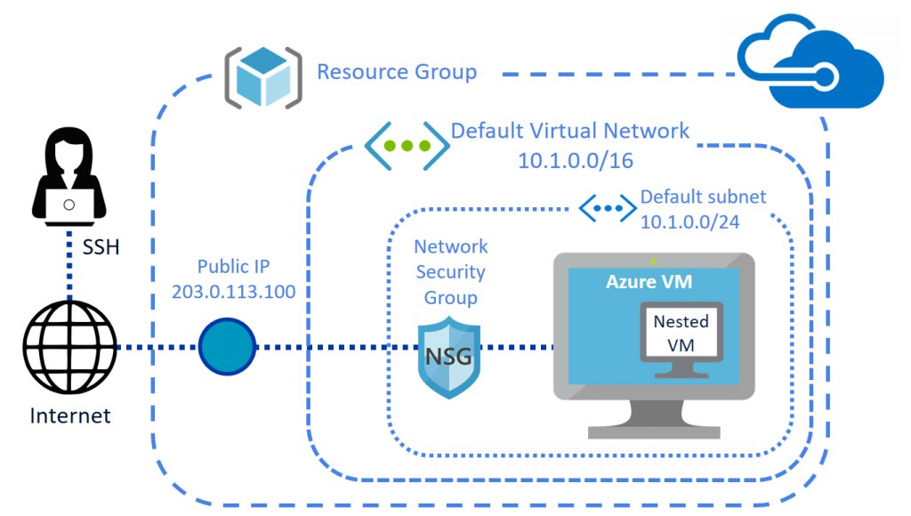

# Azure Virtual Machine

[Azure Virtual Machines documnetation can be found here](https://docs.microsoft.com/en-us/azure/virtual-machines/)
## Creating Virtual Machines using Azure Portal

## Creating Virtual Machines using Azure CLI

## Connecting to Linux Virtual Machine SSH

## Integrating with Key Vault

## Configuring VMs using extensions

## Updating Network Security Groups

## Managing Disks for Virtual Machine

